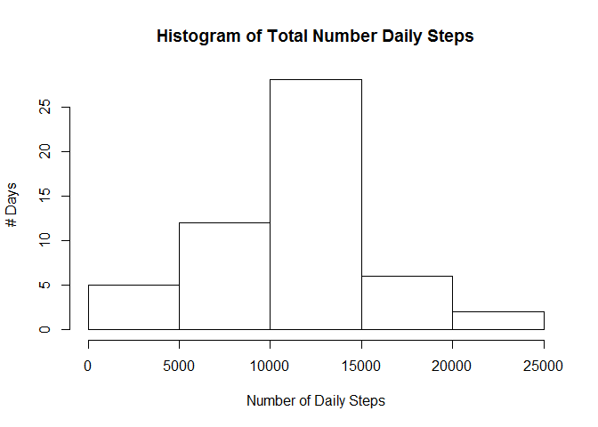
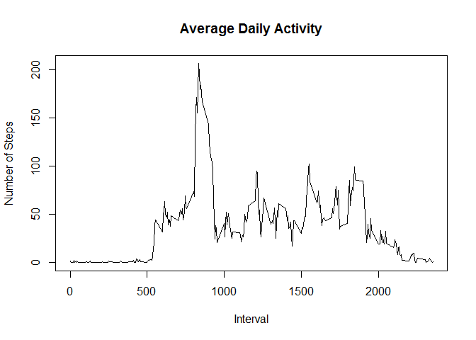
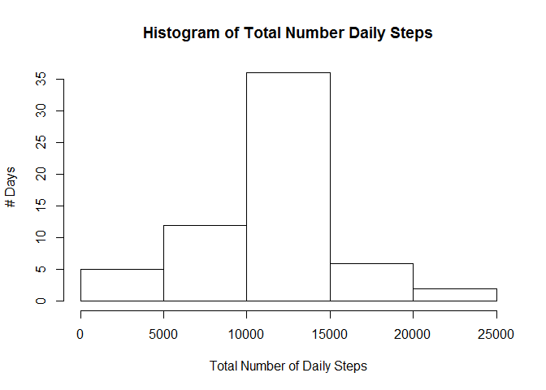
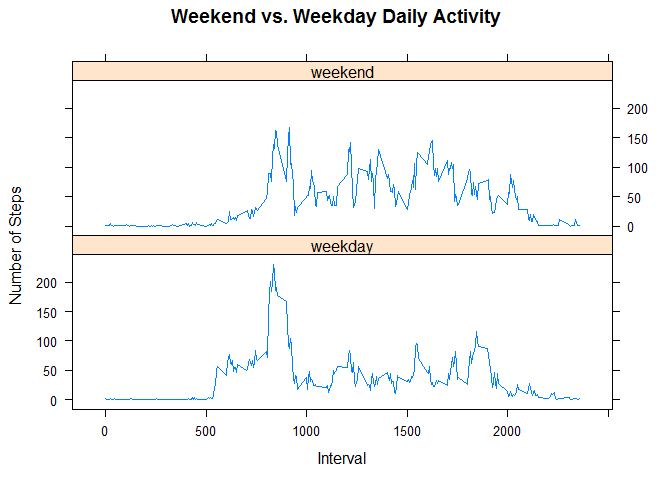

# Reproducible Research: Peer Assessment 1

We analyze data from a personal activity monitoring device. This device collects data at 5 minute intervals through out the day. The data consists of two months of data from an anonymous individual collected during the months of October and November, 2012 and include the number of steps taken in 5 minute intervals each day.

## Loading and preprocessing the data

We unzip and read the CSV activity file:


```r
    data <- read.csv(unz("activity.zip", "activity.csv"))
```

## What is mean total number of steps taken per day?

In this section, we ignore the missing values (NAs) in the dataset:


```r
    data_complete <- na.omit(data)
```

Next, we create a histogram of the total number of daily steps:


```r
    total_steps <- aggregate(data_complete$steps, list(date = data_complete$date), sum)
    names(total_steps)[names(total_steps) == 'x'] <- 'total'

    hist(total_steps$total,
         xlab="Number of Daily Steps",
         ylab="# Days",
         main="Histogram of Total Number Daily Steps")
```

 

Finally, we compute the mean number of daily steps:


```r
    mean(total_steps$total)
```

```
## [1] 10766.19
```

... and the median:


```r
    median(total_steps$total)
```

```
## [1] 10765
```

## What is the average daily activity pattern?

Using the complete data with NA's omitted, we make a time-series plot of the 5-minute interval (x-axis) and the average number of steps taken, averaged across all days (y-axis):


```r
    avg_steps <- aggregate(data_complete$steps, list(interval = data_complete$interval), mean)
    names(avg_steps)[names(avg_steps) == 'x'] <- 'steps'

    plot(avg_steps,
         type="l",
         xlab="Interval",
         ylab="Number of Steps",
         main="Average Daily Activity")
```

 

The 5-minute interval with the maximum number of steps, on average across all days, is:


```r
    avg_steps[which(avg_steps$steps == max(avg_steps$steps)),]$interval
```

```
## [1] 835
```


## Imputing missing values

The number of rows with missing values (NAs) is:


```r
    nrow(data) - nrow(data_complete)
```

```
## [1] 2304
```

We will create a new dataset where the missing values are filled in using the mean (over other days) for that 5-minute interval:


```r
    data_imputed <- data
    for (i in 1:nrow(data_imputed)) {
        if (is.na(data_imputed$steps[i])) {
            data_imputed$steps[i] <- avg_steps[avg_steps$interval==data$interval[i], "steps"]
        }
    }
```

We now repeat our earlier histogram of the total number of daily steps, this time using the new data set (with the imputed values):


```r
    total_steps_imputed <- aggregate(data_imputed$steps, list(date = data_imputed$date), sum)
    names(total_steps_imputed)[names(total_steps_imputed) == 'x'] <- 'total'
    hist(total_steps_imputed$total,
         xlab="Total Number of Daily Steps",
         ylab="# Days",
         main="Histogram of Total Number Daily Steps")
```

 

The mean and median, respectively, are:


```r
    mean(total_steps_imputed$total)
```

```
## [1] 10766.19
```

```r
    median(total_steps_imputed$total)
```

```
## [1] 10766.19
```

Compared with the earlier computed mean and median (of the data set with NA values simply removed), the difference in mean and median are:


```r
    mean(total_steps_imputed$total) - mean(total_steps$total)
```

```
## [1] 0
```

```r
    median(total_steps_imputed$total) - median(total_steps$total)
```

```
## [1] 1.188679
```

Thus we see no impact on the mean (as expected, given the method of imputing the missing values), and only a slight change to the median.

## Are there differences in activity patterns between weekdays and weekends?

We add a new factor variable to the imputed dataset indicating if the data is a weekday or weekend:


```r
    data_imputed$day <- factor(weekdays(as.Date(data_imputed$date)) %in% c("Saturday", "Sunday"),
                               levels=c(FALSE, TRUE),
                               labels=c("weekday", "weekend"))
```

Now we create a time-series plot of the 5-minute interval (x-axis) and the average number of steps taken, averaged across all weekday OR weekend days (y-axis):


```r
    avg_steps_imputed <- aggregate(data_imputed$steps, list(interval = data_imputed$interval, day = data_imputed$day), mean)
    names(avg_steps_imputed)[names(avg_steps_imputed) == 'x'] <- 'steps'

    library(lattice)
    xyplot(steps ~ interval | day, avg_steps_imputed,
         layout=c(1,2),
         type="l",
         xlab="Interval",
         ylab="Number of Steps",
         main="Weekend vs. Weekday Daily Activity")
```

 

As we can see, there is significant variation in average daily activity on weekdays vs. weekends. Weekend days start out less active and have more activity throughout the day, whereas weekday days are more sedentary after an intial morning spike of activity (perhaps a morning work-out or physically intensive commute to work).
